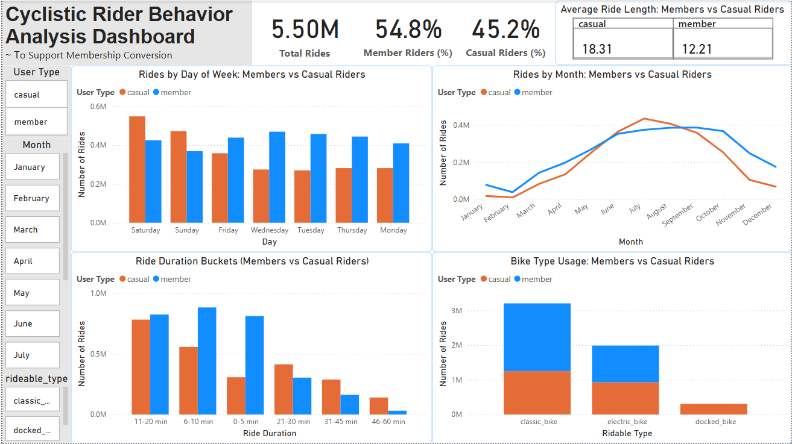

# 🚴‍♂️ Cyclistic Rider Behavior Analysis Dashboard (Cyclistic Bike-Share Case Study)
### *A Google Data Analytics Capstone Project*

This repository contains the full analysis, Power BI dashboard, and final report for the Cyclistic Bike-Share Case Study.  
The goal of this project is to understand how **casual riders** and **annual members** use Cyclistic differently and provide insights to help convert casual riders into paying members.

---

##  1. Business Task

Cyclistic aims to increase its annual membership base because annual members generate higher long-term revenue than casual riders.  
The key business question is:

**“How do annual members and casual riders differ in their bike usage behavior, and how can Cyclistic use these insights to improve membership conversions?”**

---

##  2. Data Source

The analysis uses **12 months of Cyclistic (Divvy) bike-share trip data**, publicly available [here](https://divvy-tripdata.s3.amazonaws.com/index.html) under open license from Motivate International Inc.

- Format: CSV files  
- Period: Previous 12 months  
- R million  
- No personally identifiable information (PII) is included  
- Data covers: ride timestamps, bike types, rider type, locations, etc.  

All data was cleaned, transformed, and analyzed using **Power BI (Power Query + DAX)**.

---

##  3. Tools & Technologies

- **Power BI** – Dashboard, modeling, DAX measures  
- **Power Query** – Data cleaning and transformation  
- **DAX** – Measures for KPIs and percentage filters  
- **GitHub** – Project documentation  
- **Microsoft Excel** (initial testing)

---

##  4. Data Preparation (Power Query Steps)

The following cleaning and transformation steps were applied:

### ✅ Data Cleaning
- Removed null or missing values  
- Removed invalid records (negative, 0-minute rides)  
- Standardized data types  

### ✅ Feature Engineering
New calculated columns added:

- **ride_length_minutes**  
  `Duration.TotalMinutes([ended_at] - [started_at])`

- **ride_length_bucket**  
  Categorized into:
  `0–5, 6–10, 11–20, 21–30, 31–45, 46–60, 60+ minutes`

- **day_of_week**  
- **month**  
- **weekday_number** (for proper sorting)

These steps prepared the dataset for fast DAX calculations and visualization.

---

## 📈 5. Power BI Dashboard

The dashboard includes the following key analyses:

### ✅ KPI Metrics
- Total Rides  
- % Casual Riders  
- % Member Riders  
- Avg Ride Duration (Members vs Casual)

### ✅ Visual Insights
- **Rides by Day of Week** (commute vs leisure patterns)  
- **Monthly Trends** (seasonality analysis)  
- **Ride Duration Buckets** (distribution differences)  
- **Bike Type Usage** (classic vs electric)  

###  Dashboard Screenshot

---

## 🔍 6. Key Insights

### 1️⃣ **Casual riders take longer rides**
- Casual Avg: **18.31 minutes**  
- Members Avg: **12.21 minutes**  

Casual riders use bikes for **recreation**, while members ride for **commuting**.

### 2️⃣ **Casuals peak on weekends, members on weekdays**
- Casual: Highest on **Saturday & Sunday**  
- Members: Highest Monday–Friday  

This confirms leisure vs commute patterns.

### 3️⃣ **Seasonality affects casual riders more**
- Both groups peak during **summer**  
- Casual usage fluctuates greatly  
- Member usage is more stable  

### 4️⃣ **Ride duration buckets differ dramatically**
- Members dominate **short rides** (0–20 min)  
- Casuals dominate **longer rides** (21–60 min)

### 5️⃣ **Bike type preferences are different**
- Members prefer **classic bikes**  
- Casual riders use **electric bikes** more often  

---

## ✅ 7. Final Recommendations

### ✅ **1. Weekend Membership Promotions**
Target casual weekend riders with:
- Weekend passes  
- Seasonal membership discounts  
- Tourist promotions  
- Referral bonuses 

### ✅ **2. Market Memberships as a Commuter Solution**
Promote:
- Convenience  
- Unlimited rides  
- Cost savings vs per-ride fees  
- Priority access  

Target office commuters near business districts and transit hubs.

### ✅ **3. Incentives for Electric Bike Users**
Offer:
- Electric-bike credits  
- Discounted membership upgrades  
- Exclusive electric bike benefits  

Appeal directly to casual riders who favor convenience.

---

## 📄 8. Files Included in this Repository
Cyclistic-Bike-Share-Case-Study/
- Cyclistic_Dashboard.pbix # Power BI dashboard
- Cyclistic_Case_Study_Report.pdf # Full written report
- images/ # Dashboard screenshots
- README.md # Project documentation

---

## ⭐ 9. About This Project

This project was completed as part of the **Google Data Analytics Professional Certificate**.  
It demonstrates skills in:

- Data cleaning  
- Data modeling  
- Visualization  
- DAX  
- Business analysis  
- Dashboard design  
- Storytelling with data  

---

## 🤝 10. Contact

**Nilesh Tayade**  
Aspiring Data Analyst   
[Github](https://github.com/nileshtayade2003)  | [Linkedin](https://linkedin.com/in/nilesh-tayade) | [Gmail](mailto:nileshtayade2003@gmail.com)  

Feel free to connect for feedback, collaboration, or Suggestions!
